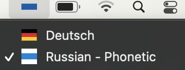

Cyrillic keyboard with bsb flag
=================

For particular reason I don't like to look at *that* flag anymore.
So I change my keyboard layout und set bsb flag




How to install
--------------

* Copy 'bsb.bundle' into /Library/Keyboard\\ Layouts like this:


```
    cd /tmp && git clone https://github.com/bobviivi/bsb-flag-bundle.git
    cp -r bsb-flag-bundle/bsb.bundle ~/Library/Keyboard\ Layouts/
```
* OR Double click on  bsb.bundle file, than add for all users


* Go to language preferences, press "+" button and add "Russian with bsb flag " layout.


 

How to use
----------

As usual